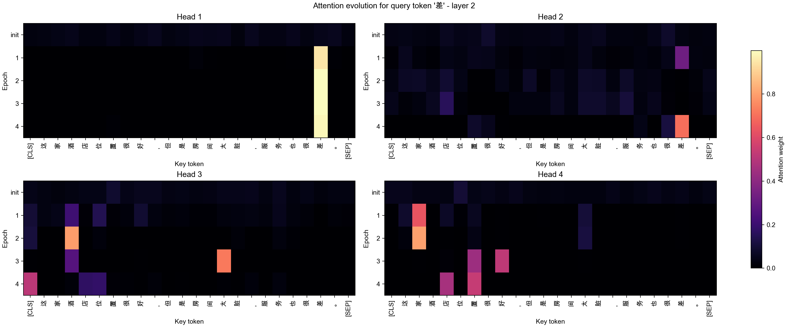
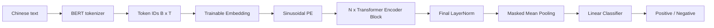

# Transformer Classifier from Scratch

用 PyTorch 手写 scaled dot-product attention、多头自注意力和 Transformer Encoder，
在 ChnSentiCorp 中文情感二分类上完成训练、评估、梯度监控与注意力演化可视化。

本项目来自
[`llm-beginner/task-1-transformer`](https://github.com/xiezhx9/llm-beginner/tree/master/task-1-transformer)，
拆分时保留了 Task 1 的 Git 历史，并补齐了独立运行所需的自检 harness。

## 项目结果

| 验收项 | 结果 | 通过标准 |
|---|---:|---:|
| Attention 最大绝对误差 | `7.15e-7` | `< 1e-5` |
| Causal mask 未来信息泄漏 | `0` | `< 1e-6` |
| ChnSentiCorp dev accuracy | **`0.845`** | `>= 0.80` |

模型训练时还记录了 loss、裁剪前全局梯度范数，以及固定探针句中每个 attention
head 随 epoch 的变化。



## 实现内容

- 不使用 `nn.MultiheadAttention`，手写 Q/K/V 投影、分头、mask、softmax 与合并。
- 手写 Transformer Encoder Block：Pre-LN attention、FFN、residual、dropout。
- 使用中文 BERT tokenizer 的词表和分词规则，但 Embedding 与 Transformer 权重均随机初始化，
  **没有加载预训练 BERT 权重**。
- 使用 sinusoidal positional encoding 注入绝对位置信息。
- 使用 padding-aware mean pooling 汇总句子，避免 PAD token 污染分类向量。
- 支持返回真实 softmax attention weights，用于热图和训练过程可视化。
- 实现 AdamW 训练、梯度裁剪、验证集评估和最佳 checkpoint 保存。

## 模型结构



默认模型配置：

```text
d_model=64
n_heads=4
n_layers=2
ff_dim=128
dropout=0.1
max_len=64
num_classes=2
```

## 核心公式

Scaled dot-product attention：

$$
\operatorname{Attention}(Q,K,V)
=\operatorname{softmax}\left(
\frac{QK^T}{\sqrt{d_k}}+M
\right)V.
$$

其中被屏蔽位置在 $M$ 中填入极小值，使 softmax 后权重接近 0。

Pre-LN Encoder Block：

$$
X'=X+\operatorname{MHA}(\operatorname{LN}(X)),
$$

$$
Y=X'+\operatorname{FFN}(\operatorname{LN}(X')).
$$

Padding-aware mean pooling：

$$
h=\frac{\sum_t m_tH_t}{\max(1,\sum_t m_t)}.
$$

## 代码中的关键技巧

### 1. Mask 使用 `masked_fill`，不能直接乘 0

```python
scores = scores.masked_fill(mask, torch.finfo(scores.dtype).min)
weights = torch.softmax(scores, dim=-1)
```

若只把被屏蔽 score 乘 0，softmax 后该位置仍会获得正概率。项目约定
`mask=True` 表示不可见，并允许 mask 广播到 `[B, H, Tq, Tk]`。

### 2. 多头拆分后交换维度

```python
q = q.reshape(B, T, H, head_dim).transpose(1, 2)
# [B, T, H, Dh] -> [B, H, T, Dh]
```

把 head 放在 token 维前面，才能让矩阵乘法自然得到每个 head 的
`[Tq, Tk]` attention score。合并时先 transpose 回去，再调用
`.contiguous().reshape(B, T, D)`，避免非连续内存上的 `view` 问题。

### 3. Padding 同时影响 attention 和 pooling

Padding key 必须在 attention score 中屏蔽；最终 mean pooling 也必须只对真实 token
求和。仅做其中一步仍会让 PAD 影响句子表示。

### 4. 可视化使用模型真实权重

`get_attention_weights()` 复用指定 Encoder 层的实际 LayerNorm、Q/K/V 和 mask，
而不是训练后重新构造一套近似 attention。固定 probe sentence 和 query token 后，
逐 epoch 保存多头权重，才能比较注意力随训练发生的变化。

### 5. 梯度裁剪记录的是裁剪前 norm

```python
grad_norm = torch.nn.utils.clip_grad_norm_(model.parameters(), max_norm=1.0)
```

返回值是裁剪前的全局 L2 norm，可用于发现梯度 spike；裁剪统一缩放所有梯度，
不会改变整体方向。

## 快速开始

推荐 Python 3.11。

```bash
git clone https://github.com/xiezhx9/transformer-classifier-from-scratch.git
cd transformer-classifier-from-scratch

python3 -m venv .venv
source .venv/bin/activate
pip install -r requirements.txt
```

下载数据：

```bash
python data/download.py
```

训练：

```bash
python -m src.train
```

自检：

```bash
python eval/run.py
```

`ckpt/` 和下载后的数据不会提交 Git。Fresh clone 可以直接运行 attention 与 causal
mask 数值自检；分类准确率测试需要先训练得到 `ckpt/best.pt`。

## 仓库结构

```text
.
├── artifacts/                # 已提交的训练曲线与注意力可视化
├── data/download.py          # ChnSentiCorp 下载脚本
├── eval/run.py               # attention、causal mask、accuracy 自检
├── notes/                    # Transformer 与工程实现笔记
├── src/
│   ├── SinusoidalPE.py
│   ├── attention.py
│   ├── block.py
│   ├── model.py
│   └── train.py
├── _eval_harness.py
└── requirements.txt
```

## 结果文件

- [Loss 曲线](artifacts/attention_evolution_run/loss_curve.png)
- [Gradient norm](artifacts/attention_evolution_run/gradient_norm.png)
- [单次 attention heatmap](artifacts/attention_evolution_run/attention_heatmap.png)
- [Attention evolution](artifacts/attention_evolution_run/attention_evolution.png)
- [All-head evolution](artifacts/attention_evolution_run/attention_evolution_all_heads.png)
- [Attention evolution GIF](artifacts/attention_evolution_run/attention_evolution.gif)

## 局限与后续工作

- 当前结果来自单一默认配置，没有完成 head/layer 数量的系统消融。
- 使用 tokenizer 词表不等于使用预训练语义；Embedding 从随机初始化开始学习。
- Attention heatmap 能帮助解释信息流，但不能单独证明模型的因果决策依据。
- 可继续对比 `[CLS]` pooling、masked mean pooling 和 attention pooling。
- 可将 sinusoidal PE 替换为 RoPE，并比较长序列外推和分类效果。

## License

本项目沿用原仓库许可证，见 [LICENSE](LICENSE)。
