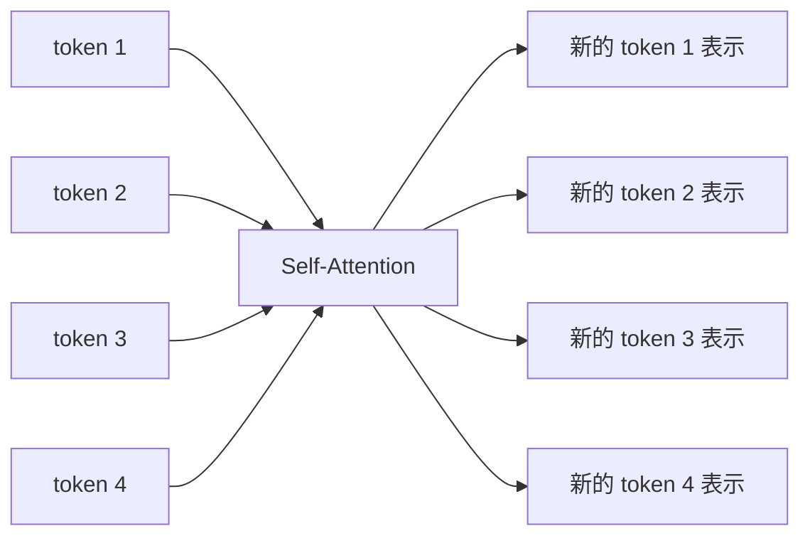
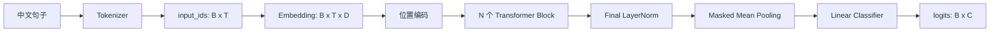

---
tags:
  - 机器学习
  - 深度学习
  - Transformer
  - Attention
aliases:
  - 注意力机制
  - Transformer注意力
---

# Chapter 8：注意力机制与 Transformer

> [!summary] 核心主线
> Attention 让每个 Query token 根据当前任务，动态决定应该从哪些 Key token 读取多少 Value 信息。Transformer 再通过多头机制、位置编码、残差连接、LayerNorm 和 FFN，把 Attention 组织成可堆叠的网络模块。

> [!info] 笔记分工
> 本文侧重 Attention 的数学原理、形状和 mask；我们的分类器代码、训练流程与工程 trick 见 [[Task1-Transformer分类器实现与工程技巧]]。

## 1. 为什么需要注意力机制

传统 RNN/LSTM 按时间顺序处理 token：

$$
h_t=\mathrm{LSTMCell}(x_t,h_{t-1},c_{t-1})
$$

虽然 LSTM 用记忆状态 $c_t$ 缓解了长期依赖问题，但仍有两个主要限制：

1. token 必须依次计算，难以充分并行。
2. 远距离信息必须经过很多中间状态传递，路径较长。

Self-Attention 让任意两个 token 直接建立联系，信息传递路径缩短为一步：



## 2. 输入张量的形状

文本经过 tokenizer 后先得到 token ID，再通过 `nn.Embedding` 得到稠密向量：

$$
X\in\mathbb R^{B\times T\times D}
$$

| 符号 | 含义 |
|---|---|
| $B$ | batch 中的句子数量 |
| $T$ | 每个 batch 中 padding 后的 token 数量 |
| $D$ | 每个 token 的特征维度，即 `d_model` |

例如：

```python
X = torch.randn(2, 5, 8)
```

表示：

- batch 中有 2 句话；
- 每句话统一为 5 个 token；
- 每个 token 用 8 维向量表示。

训练时输入通常是一批句子，因此有 batch 维度。推断时即使只输入一句话，也会保留 $B=1$：

$$
X\in\mathbb R^{1\times T\times D}
$$

## 3. Q、K、V 是怎么得到的

输入 $X$ 分别经过三个可学习线性变换：

$$
Q=XW_Q,
\qquad
K=XW_K,
\qquad
V=XW_V
$$

如果希望它们仍保持 $D$ 维，则：

$$
W_Q,W_K,W_V\in\mathbb R^{D\times D}
$$

于是：

$$
Q,K,V\in\mathbb R^{B\times T\times D}
$$

PyTorch：

```python
self.Wq = nn.Linear(d_model, d_model)
self.Wk = nn.Linear(d_model, d_model)
self.Wv = nn.Linear(d_model, d_model)

Q = self.Wq(X)
K = self.Wk(X)
V = self.Wv(X)
```

Q、K、V 的维度不是数学上必须与 $X$ 相同，而是常见的工程设计。只要最后能正确完成矩阵乘法即可。

直觉上：

- Query：当前 token 想寻找什么信息。
- Key：当前 token 可以用什么特征被其他 token 匹配。
- Value：匹配成功后，真正传递出去的信息。

初始的 Embedding、$W_Q$、$W_K$、$W_V$ 都可以是随机的。相关性不是初始化时保证的，而是分类损失经过反向传播逐渐学习出来的。

## 4. Scaled Dot-Product Attention

### 4.1 完整公式

$$
\mathrm{Attention}(Q,K,V)
=
\mathrm{softmax}\left(
\frac{QK^\top}{\sqrt{d_k}}+M
\right)V
$$

其中：

- $QK^\top$：Query 与所有 Key 的相似度。
- $d_k$：每个 Key/Query 的特征维度。
- $M$：mask，被屏蔽的位置填入极小值。
- softmax：将相似度变成每行和为 1 的注意力权重。
- 乘 $V$：按权重汇总 Value 信息。

### 4.2 形状推导

单头情况下：

$$
Q\in\mathbb R^{B\times T_q\times d_k}
$$

$$
K\in\mathbb R^{B\times T_k\times d_k}
$$

所以：

$$
QK^\top
\in
\mathbb R^{B\times T_q\times T_k}
$$

矩阵中的元素：

$$
s_{ij}=q_i^\top k_j
$$

表示第 $i$ 个 Query token 对第 $j$ 个 Key token 的匹配分数。

### 4.3 为什么除以 $\sqrt{d_k}$

假设 Query 和 Key 各分量近似独立、均值为 0、方差为 1：

$$
q^\top k=\sum_{r=1}^{d_k}q_rk_r
$$

近似有：

$$
\mathrm{Var}(q^\top k)\approx d_k
$$

因此其标准差约为：

$$
\sqrt{d_k}
$$

除以 $\sqrt{d_k}$ 后：

$$
\mathrm{Var}\left(
\frac{q^\top k}{\sqrt{d_k}}
\right)\approx1
$$

这样可以避免 $d_k$ 较大时 logits 过大，使 softmax 过早饱和、梯度接近 0。

这里并不是说 Q、K 被显式做了单位归一化。均值约 0、方差尺度适中主要来自合理初始化、LayerNorm 和训练过程，是用于解释缩放因子的近似假设。

### 4.4 PyTorch 实现

```python
def scaled_dot_product_attention(Q, K, V, mask=None):
    dk = Q.shape[-1]
    scores = Q @ K.transpose(-1, -2) / math.sqrt(dk)

    if mask is not None:
        scores = scores.masked_fill(
            mask,
            torch.finfo(scores.dtype).min,
        )

    weights = torch.softmax(scores, dim=-1)
    return weights @ V
```

softmax 必须在最后一个维度 $T_k$ 上计算，因为每个 Query 要在所有 Key 之间分配注意力。

## 5. Mask 机制

多头 scores 的统一形状是：

$$
S\in\mathbb R^{B\times H\times T_q\times T_k}
$$

| 符号 | 含义 |
|---|---|
| $B$ | batch size |
| $H$ | head 数量 |
| $T_q$ | Query token 数量 |
| $T_k$ | Key/Value token 数量 |

mask 不一定一开始就是完整的 $B\times H\times T_q\times T_k$，只要能广播到该形状即可。

### 5.1 Padding mask

两句话长度不同：

```text
句子 1: [我, 喜, 欢, 它]
句子 2: [很, 好, PAD, PAD]
```

有效位置 mask：

```python
valid_mask = torch.tensor([
    [True, True, True, True],
    [True, True, False, False],
])  # [B, T]
```

注意力函数约定 `True = 屏蔽`，因此：

```python
padding_mask = ~valid_mask[:, None, None, :]
# [B, 1, 1, T_k]
```

它广播为：

$$
[B,1,1,T_k]
\longrightarrow
[B,H,T_q,T_k]
$$

广播到 Query 维度时，本质上是把同一行 Key 屏蔽规则复制 $T_q$ 次。原因是：无论哪个 Query 发起注意力，都不能读取 PAD Key。

### 5.2 Causal mask

自回归生成中，第 $i$ 个 token 不能看到未来 token：

$$
M=
\begin{bmatrix}
0&-\infty&-\infty&-\infty\\
0&0&-\infty&-\infty\\
0&0&0&-\infty\\
0&0&0&0
\end{bmatrix}
$$

布尔形式：

```python
causal_mask = torch.triu(
    torch.ones(T, T, dtype=torch.bool),
    diagonal=1,
)
```

对普通的 decoder-only LLM，自注意力通常使用 causal mask；Encoder 分类模型通常不使用 causal mask，因为每个 token 可以同时查看前后文。

### 5.3 为什么先 masked_fill 再 softmax

如果被屏蔽分数变为 $-\infty$：

$$
\exp(-\infty)=0
$$

所以经过 softmax 后该位置权重严格为 0。mask 并不是直接参与乘法，而是先修改 scores，再由 softmax 把它转成零概率。

### 5.4 Padding Query 行什么时候丢弃

Padding mask 主要禁止读取 PAD Key，但 PAD Query 对应的行可能仍会产生输出。Transformer 通常通过后续步骤消除它们的影响：

- masked mean pooling 不把 PAD token 纳入平均。
- token-level loss 使用 `ignore_index` 忽略 PAD 标签。
- 下一层继续禁止其他 token 读取 PAD Key。

## 6. 多头注意力

### 6.1 为什么分成多个 head

单个 head 只有一种匹配空间。多个 head 可以学习不同关系，例如：

- 相邻 token；
- 转折关系；
- 情感词；
- 主谓关系；
- 标点或特殊 token。

设：

$$
D=H\cdot d_k
$$

例如：

$$
D=64,\qquad H=4,\qquad d_k=16
$$

### 6.2 拆分形状

从：

$$
[B,T,D]
$$

变为：

$$
[B,T,H,d_k]
$$

再交换 token 与 head 维度：

$$
[B,H,T,d_k]
$$

PyTorch：

```python
Q = self.Wq(X)
Q = Q.reshape(B, T, H, dk).transpose(1, 2)
```

把 head 放在 $T$ 前面，是为了让矩阵乘法始终作用在最后两个维度：

$$
[T_q,d_k]\times[d_k,T_k]
\rightarrow[T_q,T_k]
$$

如果保持 `[B, T, H, dk]` 直接相乘，最后两个维度会被解释成 `[H, dk]`，token 维不会形成期望的两两注意力矩阵。

### 6.3 合并多头

每个 head 输出：

$$
[B,H,T,d_k]
$$

先交换回去：

$$
[B,T,H,d_k]
$$

再拼接：

$$
[B,T,D]
$$

```python
context = context.transpose(1, 2).contiguous()
context = context.reshape(B, T, D)
output = self.Wo(context)
```

`contiguous()` 将 transpose 后的非连续视图重新整理成连续内存，便于后续 `view` 或某些底层算子使用。

### 6.4 为什么还需要 $W_O$

多头只是把不同 head 的结果拼接起来。输出投影：

$$
\mathrm{MHA}(X)
=
\mathrm{Concat}(head_1,\ldots,head_H)W_O
$$

允许模型重新混合各个 head 的信息，并把输出映射回统一的 $D$ 维特征空间，方便残差相加。

## 7. 位置编码

Self-Attention 本身只根据内容匹配，不知道 token 的先后顺序，因此需要加入位置信息。

### 7.1 正余弦位置编码

$$
PE(pos,2i)
=
\sin\left(
\frac{pos}{10000^{2i/D}}
\right)
$$

$$
PE(pos,2i+1)
=
\cos\left(
\frac{pos}{10000^{2i/D}}
\right)
$$

- $pos$：token 的行号，即序列位置。
- $2i$、$2i+1$：特征向量中的偶数列和奇数列。
- $i$：特征列号按二元组分组后的编号。

位置编码通常在进入第一个 Transformer Block 之前加入：

$$
X_0=\mathrm{Embedding}(input\_ids)+PE
$$

`max_len` 用于提前生成足够长的位置编码表，并注册为 buffer：

```python
self.register_buffer("pe", pe)
```

buffer 会随模型迁移设备和保存 checkpoint，但不会被优化器更新。

### 7.2 RoPE

现代 decoder-only LLM 更常使用旋转位置编码 RoPE。它不是把位置向量直接加到 $X$，而是根据位置旋转 Q、K 的二维特征对，使注意力分数自然包含相对位置信息。

正余弦绝对位置编码适合学习 Transformer 基本结构；RoPE 是现代 LLM 中更常见的后续扩展。

## 8. LayerNorm、残差连接与 FFN

本项目使用 Pre-LN Transformer Encoder Block：

$$
Z
=
X+
\mathrm{Dropout}
\left(
\mathrm{MHA}(\mathrm{LN}(X),M)
\right)
$$

$$
Y
=
Z+
\mathrm{Dropout}
\left(
\mathrm{FFN}(\mathrm{LN}(Z))
\right)
$$

其中：

$$
\mathrm{FFN}(x)
=
W_2\,\mathrm{GELU}(W_1x+b_1)+b_2
$$

### 8.1 LayerNorm

LayerNorm 对每个 token 自己的 $D$ 个特征归一化：

$$
\hat x
=
\frac{x-\mu}{\sqrt{\sigma^2+\epsilon}}
$$

它不依赖 batch 统计量，因此适合变长文本、小 batch 和自回归推断。它的目标是稳定各层输入尺度，而不是把数据变成高斯分布。

### 8.2 残差连接

“残差”表示网络学习相对于原输入的增量：

$$
Y=X+F(X)
$$

如果当前子层暂时没有学到有用变换，令 $F(X)\approx0$，信息仍可沿恒等路径继续传播。残差连接也为梯度提供更短路径，帮助训练深层网络。

### 8.3 Dropout

训练时随机屏蔽部分子层输出，降低不同神经元之间的过度依赖；`model.eval()` 时自动关闭。注意力可视化必须在 eval 模式采集，否则热图变化会混入 Dropout 随机性。

## 9. 完整 Encoder 分类器

数据流：



### 9.1 Masked mean pooling

设最后一层 token 表示为 $H\in\mathbb R^{B\times T\times D}$，有效位置为 $m_t\in\{0,1\}$：

$$
h_{pool}
=
\frac{\sum_{t=1}^{T}m_th_t}
{\max(1,\sum_{t=1}^{T}m_t)}
$$

```python
mask = attention_mask.unsqueeze(-1).float()
pooled = (mask * hidden).sum(dim=1) / mask.sum(dim=1).clamp_min(1)
```

`clamp_min(1)` 防止极端情况下分母为 0。

### 9.2 分类头

$$
logits=h_{pool}W_c+b_c
$$

二分类时输出形状为：

$$
[B,2]
$$

这两个数是两个类别的 logits。训练使用 `CrossEntropyLoss`；需要概率时再执行 softmax。

## 10. 注意力如何从随机参数中学出来

模型预测错误后，分类损失对最终 logits 求梯度。梯度依次经过：

$$
\text{classifier}
\rightarrow
\text{pooling}
\rightarrow
\text{Transformer blocks}
\rightarrow
W_Q,W_K,W_V,Embedding
$$

注意力权重：

$$
A_{ij}
=
\frac{\exp(q_i^\top k_j/\sqrt{d_k})}
{\sum_r\exp(q_i^\top k_r/\sqrt{d_k})}
$$

如果读取 token $j$ 的信息有助于降低损失，反向传播就会调整 $q_i$、$k_j$ 和对应投影参数，使相关匹配分数在后续训练中更合适。没有人直接指定“它必须关注书”；这是所有可能路径共同竞争后，由目标函数筛选出的结果。

## 11. 训练过程中的注意力演化

本项目固定探针句：

> 这家酒店位置很好，但是房间太脏，服务也很差。

固定 Query token 为“差”，每个 epoch 在 `model.eval()` 和 `torch.no_grad()` 下采集最后一层注意力。

对第 $e$ 个训练阶段，取“差”对应的 Query 行：

$$
A^{(e)}_{\text{差},:}
\in\mathbb R^{T}
$$

将初始化和各 epoch 纵向堆叠：

$$
E=
\begin{bmatrix}
A^{(0)}_{\text{差},:}\\
A^{(1)}_{\text{差},:}\\
\vdots\\
A^{(N)}_{\text{差},:}
\end{bmatrix}
\in\mathbb R^{(N+1)\times T}
$$

演化热图含义：

- 横轴：被关注的 Key token。
- 纵轴：初始化及训练 epoch。
- 每一格：Query token“差”对某个 Key token 的注意力权重。
- 每一行之和为 1。

### 11.1 本次完整训练观察

完整数据训练 4 个 epoch 后，不同 head 出现明显分工：

| Head | 观察到的变化 |
|---|---|
| Head 1 | “差”迅速集中关注自身，权重约从 `0.95` 上升到接近 `1.0` |
| Head 2 | 注意力在“店”“服”“太”“差”等 token 之间重新分配 |
| Head 3 | 不同阶段偏向“酒”“太”“[CLS]”等位置 |
| Head 4 | 逐渐偏向“家”“好”“位置/店”等上下文 |

这说明不同 head 不一定都会学习直观的“情感词对情感词”关系。有些 head 会学习自关注、位置、局部结构或数据集中的统计模式。

正式产物：

- [单 head 演化热图](https://github.com/xiezhx9/llm-beginner/blob/master/task-1-transformer/artifacts/attention_evolution_run/attention_evolution.png)
- [全部 head 对比](https://github.com/xiezhx9/llm-beginner/blob/master/task-1-transformer/artifacts/attention_evolution_run/attention_evolution_all_heads.png)
- [注意力演化 GIF](https://github.com/xiezhx9/llm-beginner/blob/master/task-1-transformer/artifacts/attention_evolution_run/attention_evolution.gif)
- [原始注意力 JSON](https://github.com/xiezhx9/llm-beginner/blob/master/task-1-transformer/artifacts/attention_evolution_run/attention_evolution.json)

## 12. 如何正确阅读注意力热图

完整热图形状为：

$$
[T_q,T_k]
$$

- 纵轴：Query token，即“谁正在寻找信息”。
- 横轴：Key token，即“它正在关注谁”。
- 第 $(i,j)$ 个元素：第 $i$ 个 Query 对第 $j$ 个 Key 的注意力。

阅读时应该固定一行横向观察。例如：

> 当模型处理“差”时，它主要从哪些 token 读取信息？

不能简单寻找全图最亮的格子，因为每一行分别经过 softmax，含义是每个 Query 自己的分配比例。

> [!warning] 注意力不是严格的特征归因
> 注意力高表示信息读取权重大，但不保证该 token 对最终分类结果的因果贡献最大。解释分类原因时，还可以结合遮挡实验、输入梯度、Integrated Gradients 等方法。

## 13. 常见误区

### 误区 1：Q、K 必须先做 norm，才能假设方差约为 1

不需要显式单位归一化。缩放推导使用的是理想化方差假设，实际尺度由初始化、LayerNorm 和训练共同控制。

### 误区 2：padding mask 会删除 PAD Query 行

Padding mask 通常只禁止读取 PAD Key。PAD Query 行的影响由 pooling、loss mask 和后续层共同消除。

### 误区 3：causal mask 永远是普通下三角矩阵

自注意力且 $T_q=T_k$ 时通常表现为下三角；交叉注意力、KV cache 或局部窗口注意力中，$T_q$ 与 $T_k$ 可能不同，形状和可见区域也会变化。

### 误区 4：多头计算后直接 reshape 就一定正确

必须先把 `[B,H,T,dk]` 交换回 `[B,T,H,dk]`，再合并 $H$ 和 $d_k$。否则 token 和 head 的内存顺序会混在一起。

### 误区 5：最终热图越集中，模型一定越好

注意力集中只说明分布更尖锐。它可能捕捉到有效关键词，也可能退化成只看自身、标点或数据偏差，必须结合验证指标和多个 head 判断。

## 14. 形状速查表

| 阶段 | 形状 |
|---|---|
| `input_ids` | `[B, T]` |
| Embedding 输出 $X$ | `[B, T, D]` |
| 线性投影后的 Q/K/V | `[B, T, D]` |
| 拆分 head | `[B, H, T, dk]` |
| Attention scores | `[B, H, Tq, Tk]` |
| Padding mask | `[B, 1, 1, Tk]` |
| Causal mask | `[Tq, Tk]` 或可广播形式 |
| 每个 head 的 context | `[B, H, Tq, dk]` |
| 合并 head | `[B, Tq, D]` |
| Masked pooling | `[B, D]` |
| 分类 logits | `[B, C]` |

## 15. 引导性自测

1. 为什么 softmax 要沿 $T_k$ 维计算，而不是沿 $T_q$ 维？
2. 如果 $B=2,H=4,T=5,d_k=16$，scores 的形状是什么？
3. `[B,T]` 的 padding mask 为什么要变成 `[B,1,1,T]`？
4. 为什么 mask 要在 softmax 之前填极小值，而不能在 softmax 后简单乘 0？
5. 如果不执行 `transpose(1, 2)`，`[B,T,H,dk]` 会在哪两个维度上做矩阵乘法？
6. $W_O$ 解决了多头拼接后的什么问题？
7. Pre-LN Block 中两条残差公式分别是什么？
8. 为什么可视化注意力时要调用 `model.eval()`？
9. 为什么注意力热图不能直接等同于分类特征重要性？
10. Head 1 几乎只关注“差”自身，可能说明什么？它一定是坏现象吗？

## 16. 一句话总结

$$
\boxed{
\text{Attention}
=
\text{用 Query-Key 决定读取权重，再用权重汇总 Value}
}
$$

Transformer 的关键不是只有一条 Attention 公式，而是把 Attention 与多头表示、位置、mask、残差、归一化和逐 token FFN 组合成可以稳定堆叠并通过任务损失端到端学习的完整系统。
