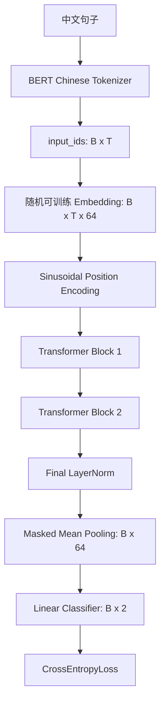

---
tags:
  - 机器学习
  - Transformer
  - 文本分类
  - PyTorch
  - 工程实践
aliases:
  - Task1 Transformer分类器
  - Transformer分类器实现
---

# Task 1：Transformer 分类器实现与工程技巧

> [!summary] 这篇笔记解决什么问题
> [[Chapter8-注意力机制与Transformer]] 重点解释 Attention 的数学原理；本文重点复盘我们如何把这些公式落成一个可训练、可评测、可观察的中文情感分类器，并解释代码中容易被忽略但非常关键的工程 trick。

项目代码：[xiezhx9/llm-beginner/task-1-transformer](https://github.com/xiezhx9/llm-beginner/tree/master/task-1-transformer)

## 1. Task 1 的目标与约束

目标是在 ChnSentiCorp 中文情感二分类任务上，从零实现一个最小 Transformer Encoder：

- 不使用 `nn.MultiheadAttention`。
- 不加载预训练语言模型权重。
- 允许使用公开 tokenizer，只负责分词和 token ID 映射。
- 手写 scaled dot-product attention、多头拆分、mask 和 Transformer Block。
- 分类准确率至少达到 `0.80`。
- 能输出注意力热图并解释模型“在看什么”。

最终本地自检结果：

| 项目 | 结果 |
|---|---:|
| Attention 与 PyTorch 官方实现最大误差 | `7.15e-7` |
| Causal mask 未来信息泄漏误差 | `0` |
| 验证集分类准确率 | `0.845` |

## 2. 最终模型结构

默认超参数：

| 参数 | 值 | 含义 |
|---|---:|---|
| `d_model` | 64 | token 隐藏向量维度 |
| `n_heads` | 4 | 注意力 head 数 |
| `dk` | 16 | 每个 head 的维度，$64/4$ |
| `ff_dim` | 128 | FFN 中间维度 |
| `n_layers` | 2 | Transformer Block 数量 |
| `n_class` | 2 | 正面/负面两类 |
| `dropout` | 0.1 | 子层输出 Dropout |
| `max_len` | 64 | 最大 token 长度 |

完整数据流：



批量前向的主要形状：

$$
[B,T]
\rightarrow
[B,T,64]
\rightarrow
[B,T,64]
\rightarrow
[B,64]
\rightarrow
[B,2]
$$

## 3. 文件职责

| 文件 | 职责 |
|---|---|
| `src/attention.py` | scaled dot-product attention、多头拆分和合并 |
| `src/block.py` | Pre-LN Transformer Encoder Block |
| `src/SinusoidalPE.py` | 正余弦位置编码 buffer |
| `src/model.py` | Tokenizer、Embedding、Block 堆叠、pooling、分类头和评测加载接口 |
| `src/train.py` | 数据、训练、验证、checkpoint、梯度/损失/注意力可视化 |
| `eval/run.py` | Attention 数值、causal mask 和分类准确率自检 |

## 4. Tokenizer 与 Embedding

### 4.1 只借 tokenizer，不借预训练模型

```python
self.tokenizer = AutoTokenizer.from_pretrained(
    "google-bert/bert-base-chinese"
)
```

Tokenizer 下载并维护：

- 词表；
- token 到整数 ID 的规则；
- `[CLS]`、`[SEP]`、`[PAD]` 等特殊 token；
- 中文 WordPiece 分词规则。

它不会返回语义稠密向量，也没有加载 BERT 模型权重。真正的向量来自我们自己创建的 Embedding：

```python
self.embedding = nn.Embedding(
    num_embeddings=len(self.tokenizer),
    embedding_dim=d_model,
    padding_idx=self.tokenizer.pad_token_id,
)
```

Embedding 初始是随机的，通过分类损失端到端学习。

> [!tip] Trick：`padding_idx`
> `padding_idx` 不只是记录 PAD 的编号。PyTorch 会让该行 Embedding 不参与梯度更新，并默认保持零向量，从源头降低 PAD 信息污染。不过后续位置编码和残差仍可能让 PAD 位置出现非零表示，所以注意力和 pooling 仍必须使用 mask。

### 4.2 为什么模型和训练脚本都持有 tokenizer

当前实现中：

- `model.py` 的 tokenizer 用于确定词表大小、PAD ID 和 `load_for_eval`。
- `train.py` 的 tokenizer 用于 batch 动态分词。

这样接口直观，但会重复加载同一份 tokenizer。更严格的工程设计可以把 tokenizer 完全放在模型外，并把 `vocab_size`、`pad_token_id` 作为模型初始化参数。

## 5. 位置编码实现

位置编码提前构造：

```python
position = torch.arange(max_len).unsqueeze(1)
frequency = torch.exp(
    torch.arange(0, d_model, 2)
    * (-math.log(10000.0) / d_model)
)
angles = position * frequency
```

然后填入偶数列和奇数列：

```python
pe[:, 0::2] = torch.sin(angles)
pe[:, 1::2] = torch.cos(angles[:, : pe[:, 1::2].shape[1]])
```

> [!tip] Trick：兼容奇数 `d_model`
> 偶数列数量可能比奇数列多 1，因此 cosine 部分使用切片 `angles[:, : pe[:, 1::2].shape[1]]`。虽然当前 `d_model=64` 是偶数，这个写法让模块对奇数维度也安全。

```python
self.register_buffer("pe", pe)
```

> [!tip] Trick：位置编码注册为 buffer
> `pe` 不是可训练参数，不能交给优化器；但它需要随 `model.to(device)` 移动，并随 state_dict 保存。`register_buffer` 正好同时满足这两个要求。

前向时还执行：

```python
pe = self.pe[:seq_len].to(device=x.device, dtype=x.dtype)
return x + pe
```

这保证混合精度或不同设备下，位置编码和输入的设备、dtype 一致。

## 6. Attention 实现中的关键 trick

### 6.1 复用真实权重计算

```python
def _attention_weights(Q, K, mask=None):
    scores = Q @ K.transpose(-1, -2) / math.sqrt(dk)
    if mask is not None:
        scores = scores.masked_fill(
            mask,
            torch.finfo(scores.dtype).min,
        )
    return torch.softmax(scores, dim=-1)
```

公开的 attention 函数和多头模块都调用同一个 `_attention_weights`：

```python
def scaled_dot_product_attention(Q, K, V, mask=None):
    return _attention_weights(Q, K, mask) @ V
```

> [!tip] Trick：只有一个注意力公式来源
> 如果可视化代码自己重新写一份 $QK^T/\sqrt{d_k}$，以后修改 mask 或缩放逻辑时，两份实现可能悄悄不一致。抽出 `_attention_weights` 后，模型前向、自检和热图使用的是同一套真实权重。

### 6.2 `torch.finfo(dtype).min`

```python
scores.masked_fill(mask, torch.finfo(scores.dtype).min)
```

它会根据当前 dtype 选择可表示的极小有限值，而不是写死 `-1e9`：

- `float32`、`float16` 的安全范围不同；
- 避免硬编码常量在低精度中溢出；
- softmax 后被屏蔽位置近似为 0。

注意：如果某一整行全部被屏蔽，所有分数都相同，softmax 仍可能得到非预期分布。因此正常输入必须保证至少存在一个有效 Key，或者额外处理全 mask 行。

### 6.3 可选返回权重，不破坏原接口

```python
def forward(self, x, mask=None, return_weights=False):
    ...
    if return_weights:
        return output, weights
    return output
```

> [!tip] Trick：兼容性扩展
> 默认仍返回 Tensor，因此已有 Block 和 README 自检接口不变；只有可视化显式传入 `return_weights=True` 时才返回 `(output, weights)`。这比直接把 forward 改成永远返回 tuple 更安全。

### 6.4 多头拆分顺序

```python
Q = Q.reshape(B, T, H, dk).transpose(1, 2)
# [B, T, D] -> [B, T, H, dk] -> [B, H, T, dk]
```

合并时：

```python
attn = attn.transpose(1, 2).reshape(x.shape)
```

> [!tip] Trick：这里使用 `reshape` 而不是 `view`
> `transpose` 后张量通常不连续。`view` 需要先 `.contiguous()`；`reshape` 会在必要时自动创建连续副本，因此当前代码可以安全省略显式 `contiguous()`。如果以后改用 `view`，必须补上 `.contiguous()`。

### 6.5 输出投影保持残差形状

```python
output = self.Wo(attn)
```

多头拼接后虽然已经回到 $D$ 维，$W_O$ 仍用于混合各 head 信息。它还保证输出形状与原始 $x$ 一致，可以直接执行：

$$
x+\mathrm{MHA}(x)
$$

## 7. Transformer Block

当前 Block 使用 Pre-LN：

```python
y = x + self.dropout1(
    self.attn(self.layer_norm1(x), mask)
)

z = y + self.dropout2(
    self.ffn(self.layer_norm2(y))
)
```

数学形式：

$$
y=x+\mathrm{Dropout}(\mathrm{MHA}(\mathrm{LN}(x)))
$$

$$
z=y+\mathrm{Dropout}(\mathrm{FFN}(\mathrm{LN}(y)))
$$

> [!tip] Trick：Pre-LN 帮助深层训练
> 子层先接收尺度稳定的输入，同时残差主干保持直接的恒等路径。与原始 Transformer 的 Post-LN 相比，Pre-LN 通常更容易优化。Block 堆叠结束后再补一个 Final LayerNorm。

FFN：

```python
self.ffn = nn.Sequential(
    nn.Linear(d_model, ff_dim),
    nn.GELU(),
    nn.Linear(ff_dim, d_model),
)
```

它逐 token 独立处理，不在 token 之间混合信息。token 间通信由 Attention 完成，特征维上的非线性变换由 FFN 完成。

## 8. Mask 只维护一份语义

模型内部先生成 `True = 有效 token`：

```python
def _valid_token_mask(self, input_ids, lengths=None):
    if lengths is not None:
        return (
            torch.arange(input_ids.shape[1], device=input_ids.device)[None, :]
            < lengths[:, None]
        )
    return input_ids != self.tokenizer.pad_token_id
```

支持两种输入方式：

- 已有 `lengths` 时按长度生成；
- 普通 tokenizer 输入按 PAD ID 判断。

> [!tip] Trick：`arange` 使用 `input_ids.device`
> mask 必须与模型输入位于同一设备。不能默认在 CPU 创建，否则 MPS/CUDA 比较或后续运算会报 device mismatch。

Attention 接口约定 `True = 屏蔽`，所以只在进入 Attention 时反转并扩维：

```python
padding_mask = ~valid_mask[:, None, None, :]
```

$$
[B,T]\rightarrow[B,1,1,T]\rightarrow[B,H,T,T]
$$

> [!tip] Trick：先保持人类直觉，再在边界转换
> 模型大部分代码使用 `True = valid`，便于 pooling；Attention 边界才转成 `True = masked`。如果全项目混用两套布尔语义，很容易多写或少写一个 `~`。

## 9. Masked Mean Pooling

Block 输出：

$$
H\in\mathbb R^{B\times T\times D}
$$

当前没有只取 `[CLS]`，而是对有效 token 做平均：

```python
mask = attention_mask.unsqueeze(-1).float()
pooled = (mask * token_vec).sum(dim=-2) / mask.sum(
    dim=-2
).clamp_min(1)
```

> [!tip] Trick：不能直接 `token_vec.mean(dim=1)`
> 每个 batch 的 padding 长度不同，直接平均会把 PAD 位置也计入分母。Masked mean 只汇总真实 token，使同一句话不会因为与更长样本组 batch 而改变 pooled 表示。

> [!tip] Trick：`clamp_min(1)` 防止除零
> 正常 tokenizer 至少会产生特殊 token，但防御式代码仍保证全空 mask 时分母不为 0，避免 `NaN` 扩散。

选择 mean pooling 的含义是：所有有效 token 都参与句子汇总。因此分析模型时不能只看 `[CLS]` 那一行的注意力。

## 10. `get_attention_weights` 为什么放在模型中

```python
for index, block in enumerate(self.blocks):
    if index == layer_index:
        _, weights = block.attn(
            block.layer_norm1(token_vec),
            padding_mask,
            return_weights=True,
        )
        return weights, valid_mask, layer_index
    token_vec = block(token_vec, padding_mask)
```

它不是直接拿原始 Embedding 计算任意层注意力，而是：

1. 先执行目标层之前的所有 Block；
2. 对目标层输入执行该层真正的 `layer_norm1`；
3. 调用真实 MultiHeadAttention 并返回 softmax 权重。

> [!tip] Trick：可视化必须复现到目标层的真实数据流
> 第 2 层注意力的输入不是原始 token embedding，而是第 1 层更新后的隐藏状态。跳过前置 Block 得到的“第 2 层热图”在数学上并不是模型实际使用的注意力。

负数层号也被支持：

```python
if layer_index < 0:
    layer_index += len(self.blocks)
```

因此 `layer_index=-1` 可以稳定表示最后一层，不需要知道 Block 总数。

## 11. 数据管线

Dataset 只保存原始文本和标签：

```python
return self.texts[index], self.labels[index]
```

Collator 在组成 batch 时统一 tokenizer：

```python
encoded = tokenizer(
    list(texts),
    padding=True,
    truncation=True,
    max_length=max_length,
    return_tensors="pt",
)
```

> [!tip] Trick：动态 padding
> `padding=True` 只补到当前 batch 的最长句子，而不是每次都补到全局 `max_length=64`。短句 batch 因此减少 Attention 的 $T^2$ 计算和显存浪费。

训练集：

```python
shuffle=True
```

每个 epoch 仍遍历全部样本，只是重新打乱顺序和 batch 组合。

验证集：

```python
shuffle=False
```

验证不更新参数，打乱不会增加数据，也不会提升评估质量；保持顺序还能让结果更容易复现和排查。

## 12. 训练循环中的工程细节

### 12.1 自动选择设备

```python
if torch.backends.mps.is_available():
    device = torch.device("mps")
elif torch.cuda.is_available():
    device = torch.device("cuda")
else:
    device = torch.device("cpu")
```

当前机器优先使用 Apple Silicon 的 MPS。

### 12.2 `zero_grad(set_to_none=True)`

```python
optimizer.zero_grad(set_to_none=True)
```

默认清零会把梯度 Tensor 填成 0；设置为 `None` 可以减少内存写入，下一次 backward 时再创建梯度。优化器会正确跳过 `grad is None` 的参数。

### 12.3 AdamW 与 Weight Decay

```python
optimizer = AdamW(
    model.parameters(),
    lr=learning_rate,
    weight_decay=weight_decay,
)
```

AdamW 将自适应梯度更新与权重衰减解耦，是 Transformer 常用默认优化器。当前配置：

$$
lr=2\times10^{-3},\qquad weight\_decay=2\times10^{-2}
$$

这个学习率对大型预训练 Transformer 会过高，但我们的模型只有两层、64 维，并且从零训练，所以可行。

### 12.4 梯度裁剪与记录顺序

```python
loss.backward()
gradient_norm = clip_grad_norm_(
    model.parameters(),
    max_norm=1.0,
)
optimizer.step()
```

`clip_grad_norm_` 返回裁剪前的全局梯度范数。代码先保存该返回值，再执行更新：

```python
history["gradient_norm"].append(
    float(gradient_norm.detach().cpu())
)
```

> [!tip] Trick：图里画的是裁剪前范数
> 如果只查看裁剪后的梯度，所有超过阈值的点都会接近 1，看不出原始梯度到底爆到了多大。记录返回值可以判断裁剪是否偶尔触发，还是学习率过大导致每一步都依赖裁剪。

### 12.5 Loss 按样本数加权

`CrossEntropyLoss` 默认给出当前 batch 的平均损失。最后一个 batch 可能比其他 batch 小，因此不能简单平均每个 batch loss：

```python
batch_size = labels.size(0)
total_loss += loss.item() * batch_size
total_samples += batch_size
epoch_loss = total_loss / total_samples
```

> [!tip] Trick：样本平均，不是 batch 平均
> 这样每条样本权重相同。否则只有 2 条数据的最后一个 batch 会和 32 条数据的正常 batch 拥有相同权重。

### 12.6 最佳 checkpoint

```python
if validation_loss < best_validation_loss:
    torch.save(model.state_dict(), checkpoint_path)
```

只保存 `state_dict`，而不是 pickle 整个模型对象：

- 文件更聚焦；
- 代码结构与参数分离；
- 加载时显式重新构造模型，接口更清楚。

使用验证损失而不是训练损失选 checkpoint，可以避免保存一个只是在训练集上继续变好、但已经开始过拟合的模型。

## 13. 注意力演化记录器

固定探针句：

> 这家酒店位置很好，但是房间太脏，服务也很差。

默认观察最后一层、Head 1、Query token“差”。

### 13.1 先记录初始化状态

```python
attention_recorder.capture(model, epoch=0)
```

如果只从 Epoch 1 开始，就看不到“随机注意力如何变成训练后模式”。初始化是演化过程的重要基线。

### 13.2 关闭梯度和 Dropout

```python
@torch.no_grad()
def capture(self, model, epoch):
    was_training = model.training
    model.eval()
    try:
        ...
    finally:
        model.train(was_training)
```

这里包含三个 trick：

1. `torch.no_grad()`：不构建计算图，节省内存。
2. `model.eval()`：关闭 Dropout，使变化真正来自参数学习。
3. `try/finally`：即使采集报错，也恢复原来的训练/评估状态。

如果只写 `model.eval()` 而忘记切回训练模式，后续 epoch 的 Dropout 会一直关闭，训练行为被可视化代码悄悄改变。

### 13.3 只保存必要的 Query 行

完整权重是：

$$
[H,T,T]
$$

当前记录器只保存固定 Query token 对所有 Key 的一行：

$$
[H,T]
$$

这样 JSON 更小，也更符合“观察某个 token 如何改变关注对象”的目标。

代价是训练结束后不能随意换 Query token；如果想做交互式探索，应该保存完整矩阵或注册多个探针 token。

### 13.4 固定颜色范围制作 GIF

GIF 所有帧共享同一个最大值：

```python
maximum = float(matrix.max())
imshow(..., vmin=0, vmax=maximum)
```

> [!tip] Trick：动画不能每帧自动缩放色条
> 如果每帧都使用自己的最大值，即使真实权重没有增大，最亮颜色仍会被拉满，造成“注意力不断增强”的视觉错觉。共享颜色范围才能比较不同时点的绝对权重。

## 14. 最终热图与演化图不是同一个模型状态

训练演化记录器采集的是每个 epoch 结束时的当前模型；训练完成后：

```python
best_state = torch.load(checkpoint_path, map_location="cpu")
model.load_state_dict(best_state)
plot_attention(...)
```

最终静态热图使用最佳验证 loss checkpoint，而不是必然使用最后一个 epoch。

> [!warning] 解释图时必须知道模型状态
> `attention_evolution.png` 的最后一行表示最后 epoch；`attention_heatmap.png` 表示最佳 checkpoint。如果最佳轮次不是最后一轮，两张图不完全对应。这是当前实现中特别容易误读的地方。

更完善的做法是在每个快照中记录验证指标和是否为 best，或者最后给演化图额外加入 best checkpoint 一行。

## 15. 评测接口的兼容性

README 约定：

```python
load_for_eval(ckpt_path) -> (model, tokenize_fn)
```

`tokenize_fn` 必须把单句转换为 `[T]`：

```python
token_fn = lambda text: tokenizer(...)["input_ids"].squeeze(0)
```

评测再恢复 batch 维：

```python
logits = model(ids.unsqueeze(0))
```

Checkpoint 使用：

```python
state_dict = torch.load(ckpt_path, map_location="cpu")
```

> [!tip] Trick：`map_location="cpu"`
> 无论模型在 CUDA、MPS 还是 CPU 上训练，评测机器都可以先在 CPU 加载，不依赖原训练设备。

Attention 的数值自检并不是只检查“能运行”，而是和官方实现比较：

$$
\max|A_{ours}-A_{torch}|<10^{-5}
$$

Causal mask 自检则把未来 Value 改成 999，并确认过去输出完全不变。这是行为测试，比只查看 mask 形状更可靠。

## 16. 项目中的关键 trick 总表

| Trick | 解决的问题 |
|---|---|
| `padding_idx=pad_token_id` | PAD Embedding 不参与更新 |
| `register_buffer("pe", pe)` | PE 随设备和 checkpoint 走，但不训练 |
| `torch.finfo(dtype).min` | mask 极小值适配不同浮点精度 |
| `_attention_weights` 单一来源 | 前向与可视化公式不漂移 |
| `return_weights=False` | 扩展可视化且不破坏原接口 |
| `transpose(...).reshape(...)` | 安全合并非连续多头张量 |
| `True=valid` 到边界再取反 | 减少 mask 语义混乱 |
| `masked mean pooling` | PAD 不参与句子汇总 |
| `clamp_min(1)` | 防止 pooling 除零 |
| `zero_grad(set_to_none=True)` | 减少梯度清零内存写入 |
| loss 乘 `batch_size` 累加 | 得到真正的样本平均 loss |
| 记录裁剪前 gradient norm | 看清梯度是否频繁爆炸 |
| `eval + no_grad + finally` | 稳定采集且不改变后续训练 |
| Epoch 0 快照 | 看见注意力从随机到成形 |
| GIF 共享 `vmin/vmax` | 不制造颜色尺度错觉 |
| `map_location="cpu"` | checkpoint 跨设备加载 |
| 相对项目根解析路径 | 从不同 cwd 启动也能找到数据 |

## 17. 当前实现的限制

这些不是任务失败，而是下一轮重构值得处理的点：

1. `model.py` 仍有未使用的 `BertTokenizer` import 和较多注释掉的旧代码。
2. 模型和训练脚本各自加载 tokenizer，职责可以进一步解耦。
3. Collator 返回 `attention_mask`，训练循环却只传 `input_ids`，由模型重新计算 mask；功能正确但存在冗余。
4. 当前没有 learning-rate scheduler、warmup 和 early stopping。
5. 只设置了 Python 和 PyTorch seed，没有强制所有设备使用完全确定性算法。
6. 注意力探针遇到重复 token 时默认选择第一次出现的位置。
7. 演化记录只保存一个 Query 行，训练后无法切换任意 Query。
8. Padding mask 主要屏蔽 Key；PAD Query 依靠 masked pooling 消除影响。
9. Checkpoint 被 `.gitignore` 排除，其他人克隆仓库后需要重新训练才能跑分类准确率自检。
10. 注意力热图只能说明读取关系，不能替代严格的特征归因。

## 18. 运行与复现

```bash
cd task-1-transformer
pip install -r requirements.txt
python data/download.py
python -m src.train
python eval/run.py
```

常用调试参数：

```bash
python -m src.train \
  --epochs 2 \
  --max-train-samples 64 \
  --max-validation-samples 32 \
  --checkpoint /tmp/task1/best.pt \
  --output-dir /tmp/task1/artifacts
```

这样可以快速验证训练、checkpoint 和全部绘图流程，不覆盖正式模型。

## 19. 引导性自测

1. 为什么使用公开 tokenizer 不等于使用预训练 BERT？
2. `padding_idx` 已经让 PAD Embedding 为零，为什么仍需要 attention mask？
3. 为什么第 2 层注意力可视化必须先运行第 1 层 Block？
4. `transpose` 后为什么 `reshape` 可用，而 `view` 可能失败？
5. 为什么验证 loss 要乘当前 batch size 后再累加？
6. `clip_grad_norm_` 的返回值是裁剪前还是裁剪后范数？
7. 如果采集注意力后忘记恢复 `model.train()`，训练会发生什么变化？
8. 为什么动画每一帧必须共享颜色范围？
9. 为什么最终静态热图可能和演化图最后一行不一致？
10. 当前 mean pooling 设计下，只看 `[CLS]` 注意力是否足以解释分类？

## 20. 一句话总结

这个 Task 真正重要的不是“拼出一个能跑的 Transformer”，而是建立以下工程闭环：

$$
\boxed{
\text{数学公式}
\rightarrow
\text{形状正确的实现}
\rightarrow
\text{mask 与 pooling 防泄漏}
\rightarrow
\text{稳定训练}
\rightarrow
\text{行为自检}
\rightarrow
\text{可解释观测}
}
$$

每个 trick 都是在保护这个闭环中的某个不变量：形状不能乱、PAD 不能污染、训练模式不能被观测代码改变、评估必须按真实样本统计、热图必须来自模型真实使用的注意力。
